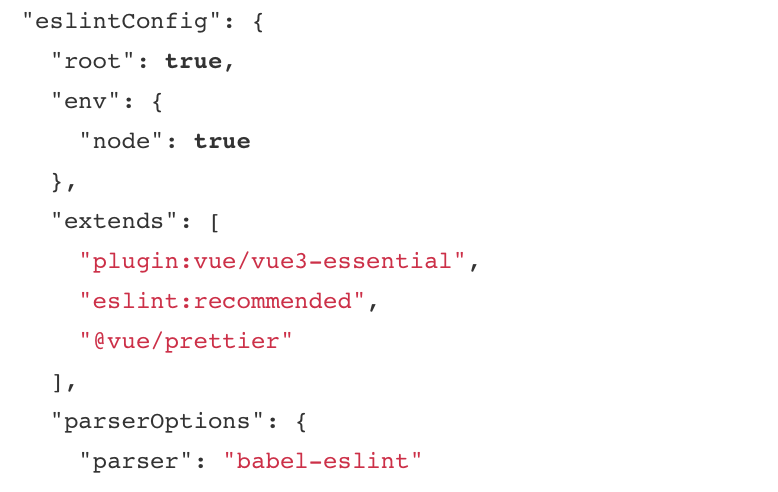

<!--
 * @Author: your name
 * @Date: 2021-03-11 15:10:13
 * @LastEditTime: 2021-06-19 16:32:51
 * @LastEditors: Please set LastEditors
 * @Description: In User Settings Edit
 * @FilePath: \lczdocs\docs\layout.md
-->

## 1.脚手架安装项目
需要注意：区分支持ts与不支持ts配置


## 2.生成.eslintrc文件
生成方式有2种
在项目根目录运行：
```html
 ./node_modules/.bin/eslint --init
```
或
```html
  npx eslint --init
```
这时候，会启用默认的eslint配置，如果想要自定义配置，可以修改.eslintrc文件的内容。

### 替换自己的配置
以下是不支持ts脚手架安装的项目    
如需支持，打开下方3处代码   
1."plugin:@typescript-eslint/eslint-recommended"    
2.parser: "@typescript-eslint/parser",    
3."@typescript-eslint",   
```html
    /*
 * @Author: lcz
 * @Date: 2021-06-19 09:42:08
 * @LastEditTime: 2021-06-19 15:38:54
 * @LastEditors: Please set LastEditors
 * @Description: eslintConfig
 * @FilePath: /code/test/.eslintrc.js
 */
module.exports = {
  env: {
    //想启用eslint的环境
    browser: true,
    es6: true,
    node: true
  },
  extends: [
    //启用推荐的规则 错误标记
    // 'eslint:recommended', //不启用默认配置，而是自定义规则
    "plugin:vue/essential"
    //   "plugin:@typescript-eslint/eslint-recommended" //支持ts检查
  ],
  globals: {
    Atomics: "readonly",
    SharedArrayBuffer: "readonly"
  },
  parserOptions: {
    ecmaVersion: 2018, //支持es2018语法
    parser:'babel-eslint',  //eslint 解析在babel之前，不然会报错
    /* 
              解析器，默认使用Espree
              eslint默认兼容3个解析器
              1、Esprima 
              2、Babel-ESLint
              3、@typescript-eslint/parser 将 TypeScript 转换成与 estree 兼容的形式，以便在ESLint中使用。
          */
    //   parser: "@typescript-eslint/parser",  //支持ts开启
    sourceType: "module" // 指定来源的类型，"script" (默认) 或 "module"（
    // "ecmaFeature":{ //想使用额外的语言特性
    // 	"jsx":true, //启用jsx
    // 	"globalReturn":true, //在全局作用域下使用return语句
    // 	"impliedStrict":true, //启用全局strict mode
    // 	"experimentalObjectRestSpread":false
    // 	//启用实验性的object rest/spread properties支持
    // 	//(不建议开启)
    // }
  },
  //插件配置 插件名称可以省略 eslint-plugin- 前缀。（用前缀就可）
  plugins: [
    "vue",
    //   "@typescript-eslint",
    /*
          //需要在最后一项检测 调用prettier检测
          原理是先使用prettier对你的代码进行格式化，然后与格式化之前的代码进行对比，如果过出现了不一致，这个地方就会被prettier标记。
      */
    "prettier"
  ],
  //规则配置
  rules: {
    // 'prettier/prettier': 'error', //表示在被prettier标记的地方抛出错误信息
    quotes: [1, "double"], //警告，必须双引号
    "no-compare-neg-zero": 2, //禁止与 -0 进行比较
    "no-cond-assign": [2, "except-parens"], //禁止条件语句中出现赋值操作符
    "no-console": 0, //允许出现console
    "no-constant-condition": 2, //禁止在条件中使用常量表达式
    "no-control-regex": 2, //禁止在正则表达式中使用控制字符
    "no-debugger": 0, //可以使用debugger
    "no-dupe-args": 2, //禁止 function 定义中出现重名参数
    "no-dupe-keys": 2, //2 禁止对象字面量中出现重复的 key 0 允许
    "no-duplicate-case": 2, //禁止出现重复的 case 标签
    "no-empty": 2, //禁止出现空语句块
    "no-empty-character-class": 2, //禁止在正则表达式中使用空字符集
    "no-ex-assign": 2, //禁止对 catch 子句的参数重新赋值
    "no-extra-boolean-cast": 2, //禁止不必要的布尔转换
    "no-extra-parens": ["error", "functions"], //禁止不必要的括号
    "no-extra-semi": 2, //禁止不必要的分号
    "no-func-assign": 2, //禁止对 function 声明重新赋值
    "no-inner-declarations": 0, //禁止在嵌套的块中出现变量声明或 function 声明
    "no-invalid-regexp": 2, //禁止 RegExp 构造函数中存在无效的正则表达式字符串
    "no-irregular-whitespace": 2, //禁止不规则的空白
    "no-obj-calls": 2, //禁止把全局对象作为函数调用
    "no-prototype-builtins": 2, //禁止直接调用 Object.prototypes 的内置属性
    "no-regex-spaces": 2, //禁止正则表达式字面量中出现多个空格
    "no-sparse-arrays": 2, //禁用稀疏数组
    "no-template-curly-in-string": 0, //禁止在常规字符串中出现模板字面量占位符语法
    "no-unexpected-multiline": 2, //禁止出现令人困惑的多行表达式
    "no-unreachable": 2, //禁止在 return、throw、continue 和 break 语句之后出现不可达代码
    "no-unsafe-finally": 2, //禁止在 finally 语句块中出现控制流语句
    "no-unsafe-negation": 2, //禁止对关系运算符的左操作数使用否定操作符
    "use-isnan": 2, //要求使用 isNaN() 检查 NaN
    "valid-jsdoc": "off", //
    "valid-typeof": 2, //强制 typeof 表达式与有效的字符串进行比较
    curly: 2, //强制所有控制语句使用一致的括号风格
    "consistent-return": [
      2,
      {
        treatUndefinedAsUnspecified: true
      }
    ],
    "default-case": 2,
    eqeqeq: "off",
    "guard-for-in": 0,
    "no-case-declarations": 0,
    "no-empty-pattern": 2,
    "no-fallthrough": 2,
    "no-global-assign": [
      2,
      {
        exceptions: []
      }
    ],
    "no-octal": 2,
    "no-redeclare": 2,
    "no-self-assign": 2,
    "no-unused-labels": 2,
    "no-useless-escape": 2,
  
    strict: 2,
  
    "no-delete-var": 2,
    "no-undefined": 0,
    "no-undef": 2,
    "no-use-before-define": 2,
  
    "array-bracket-spacing": [2, "never"],
    "block-spacing": [2, "always"],
    "brace-style": [2, "1tbs"],
    "comma-dangle": ["error", "never"],
    "comma-spacing": [
      2,
      {
        before: false,
        after: true
      }
    ],
    "comma-style": [2, "last"],
    "computed-property-spacing": ["error", "never"],
    "eol-last": [2, "always"],
    "func-call-spacing": ["error", "never"],
    indent: [
      "error",
      2,
      {
        SwitchCase: 1
      }
    ],
    "jsx-quotes": ["error", "prefer-double"],
    "key-spacing": [
      "error",
      {
        beforeColon: false,
        afterColon: true
      }
    ],
    "new-cap": [
      "error",
      {
        newIsCap: true,
        capIsNewExceptionPattern: "(Type[a-zA-Z0-9]+|Deco[a-zA-Z0-9]+)+"
      }
    ],
    "new-parens": "error",
    "no-mixed-spaces-and-tabs": 2,
    "no-multi-assign": "error",
    "no-multiple-empty-lines": "error",
  
    semi: [
      2,
      "always",
      {
        omitLastInOneLineBlock: true
      }
    ],
  
    "constructor-super": 2,
    "no-class-assign": 0,
    "no-const-assign": 2,
    "no-this-before-super": 2,
    "no-var": 2,
    "no-dupe-class-members": 2,
    "no-new-symbol": 2,
    "require-yield": 2,
    "prefer-const": 0
  }
};
```

## 3.package.json文件
当安装eslint之后，这个文件中会有这么一段配置：

root:true,默认情况下，ESLint 会在所有父级目录里寻找配置文件，一直到根目录。如果发现配置文件中有 “root”: true，它就会停止在父级目录中寻找。

## 4.校验及修复所有文件
package.json中增加
```html
  "scripts": {
    "serve": "vue-cli-service serve",
    "build": "vue-cli-service build",
    "test": "vue-cli-service build --mode testing",
    "lint": "vue-cli-service lint",
    "lint-fix": "eslint --fix --ext .js,.vue src"
  },
```
运行
```html
npm run lint 
npm run lint-fix
```

## 5.prettier
如不是脚手架安装 或者脚手架安装没选择prettier

安装前先检测package.json中是否已有脚手架的包

```html
  // 使用yarn：
  yarn add prettier --dev --exact
  // 全局安装
  yarn global add prettier

  //使用npm：
  npm i -D --save-exact prettier
  // 全局安装
  npm i --global prettier


  //安装eslint-config-prettier
  npm i -D eslint-config-prettier

  //安装 npm i -D eslint-plugin-prettier
  npm i -D eslint-plugin-prettier
```
## 6.安装prettier 插件


## 7.设置 settings.json 并将 prettier 设置为默认格式化工具
```html
  "editor.defaultFormatter": "esbenp.prettier-vscode",
  // 特定语言
  "[html]": {
    "editor.defaultFormatter": "esbenp.prettier-vscode"
  },
  "[javascript]": {
    "editor.defaultFormatter": "esbenp.prettier-vscode"
  },
  "[vue]": {
    "editor.defaultFormatter": "esbenp.prettier-vscode"
  },
  "[css]": {
    "editor.defaultFormatter": "esbenp.prettier-vscode"
  },
  "[less]": {
    "editor.defaultFormatter": "esbenp.prettier-vscode"
  },
  "[scss]": {
    "editor.defaultFormatter": "esbenp.prettier-vscode"
  },
  "[json]": {
    "editor.defaultFormatter": "esbenp.prettier-vscode"
  },
  "[jsonc]": {
    "editor.defaultFormatter": "esbenp.prettier-vscode"
  },
  "[typescript]": {
    "editor.defaultFormatter": "esbenp.prettier-vscode"
  },
  "prettier.printWidth": 120, // 句尾添加分号
  "prettier.singleQuote": true, //格式化以单引号为主
  "prettier.tabWidth": 2, // 缩进字节数
  "prettier.arrowParens": "avoid", //  (x) => {} 箭头函数参数只有一个时是否要有小括号。avoid：省略括号
  "prettier.useTabs": false, // 是否使用tab进行缩进，默认false
  "prettier.bracketSpacing": true, // 在对象，数组括号与文字之间加空格 "{ foo: bar }"
  "prettier.ignorePath": ".prettierignore", // 不使用prettier格式化的文件填写在项目的.prettierignore文件中
  "prettier.jsxBracketSameLine": false, // 在jsx中把'>' 是否单独放一行
  "prettier.eslintIntegration": false, //不让prettier使用eslint的代码格式进行校验
  "prettier.jsxSingleQuote": true, //在jsx中使用单引号代替双引号
```

这样，我们就可以使用shift+alt+f来格式化代码，可以对单个文件格式化。

## 8.项目中使用的是根目录 .prettierrc.js
项目中配置了此文件.prettierrc.js 走此文件，没配置走7.全局文件，
不建议走全局配置文件
```html
  /*
 * @Author: lcz
 * @Date: 2021-06-19 12:50:52
 * @LastEditTime: 2021-06-19 14:38:17
 * @LastEditors: Please set LastEditors
 * @Description: prettier 配置
 * @FilePath: /code/test/.prettierrc.js
 */
module.exports = {
  printWidth: 120, // 每行最大字符数，超过会换行，默认80
  semi: true, // 行尾需要有分号
  //   semi: false, // 行尾需要有分号
  //   singleQuote: true, // 字符串是否使用单引号，默认false
  singleQuote: false, // 字符串是否使用单引号，默认false
  tabWidth: 2, // 一个tab代表几个空格数，默认2
  arrowParens: "avoid", //  (x) => {} 箭头函数参数只有一个时是否要有小括号。avoid：省略括号
  useTabs: false, // 是否使用tab进行缩进，默认false
  quoteProps: "as-needed", // 对象的 key 仅在必要时用引号
  trailingComma: "none", // 是否使用尾逗号，可选值"<none|es5|all>"，默认none
  endOfLine: "lf", // 行尾换行方式，可选值"<auto|lf|crlf|cr>"，默认auto
  bracketSpacing: true, //  {   foo: bar  }  true {foo: bar} false 括号空格
  proseWrap: "preserve", // 针对特殊编辑器择行
  jsxSingleQuote: true // jsx 不使用单引号，而使用双引号
};
```
